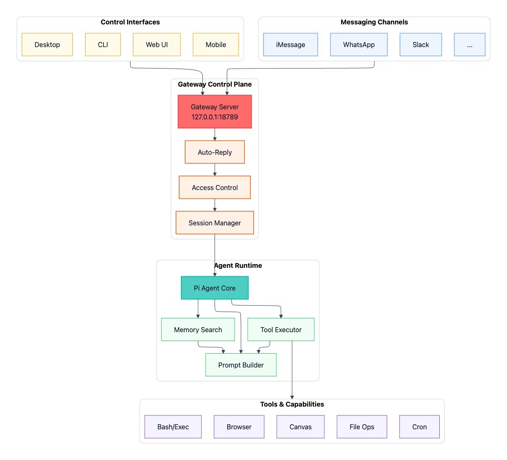
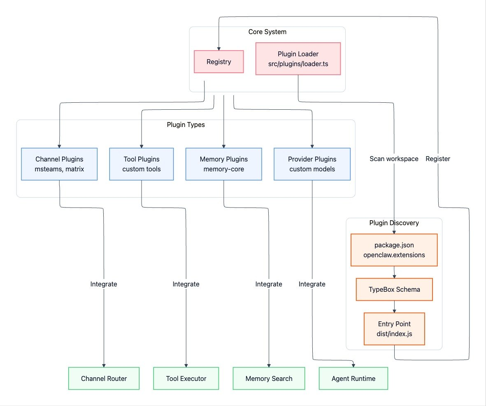
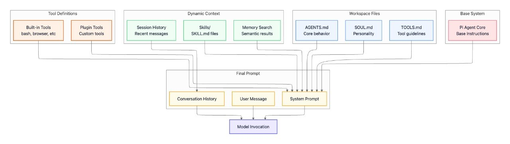
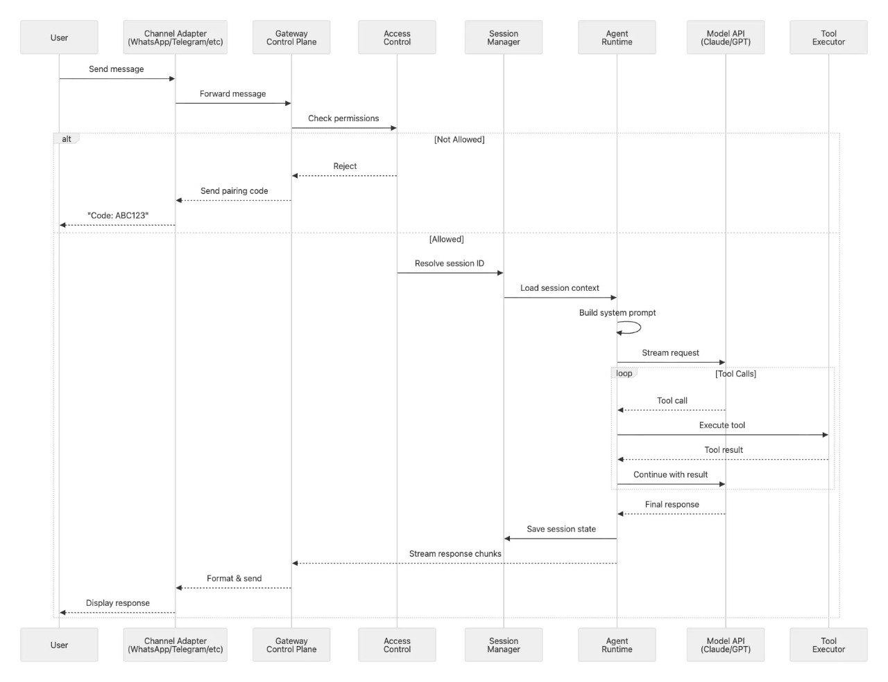
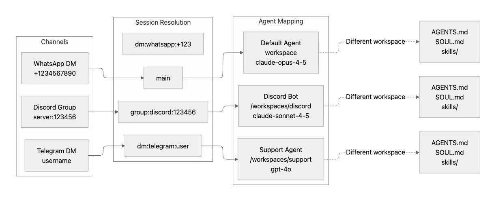
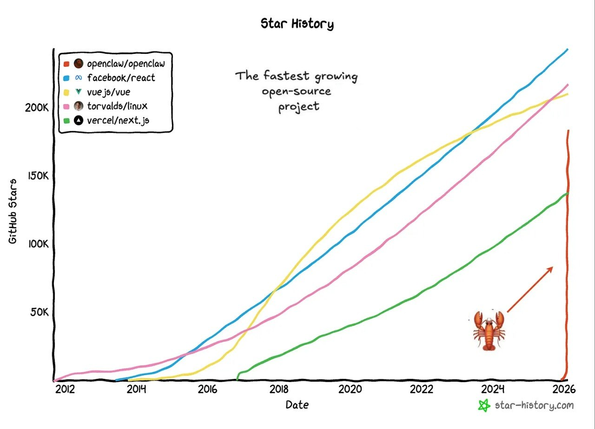
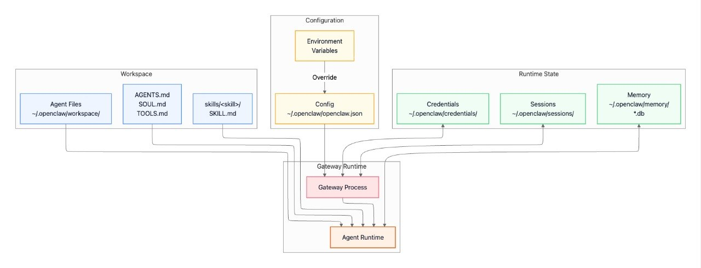

# OpenClaw Talk — Deutsch
## Moritz Sontheimer | 22. April 2026

---

## Folie 1: Titel

# OpenClaw

### _„In Her war Samantha keine App. Sie lebte im Betriebssystem — immer da, überall, durch jeden Bildschirm."_

**Dein Terminal, das zurücktextet**

**Moritz Sontheimer** | 22. April 2026

---

## Folie 1b: Die Vision — Her (2013)

[Video Clip hier einfügen](https://www.youtube.com/watch?v=dJTU48_yghs)

Der Film hat es vorhergesagt. OpenClaw baut es.

---

## Folie 2: Das Problem

### Was, wenn dein Terminal dir antworten könnte?

- KI-Coding-Agenten sind **leistungsstark**... aber im Terminal gefangen
- Du musst an der Tastatur sitzen, um sie zu nutzen
- Was, wenn du von überall aus mit deinem Rechner schreiben könntest?

**Die Lücke:** Zugriff ohne am Rechner zu sitzen

---

## Folie 3: Was ist OpenClaw?

### Self-hosted KI-Gateway

- **Lokal** — auf deiner Maschine oder Server
- **Multi-Channel** — WA, Telegram, Discord, iMessage
- **Agent-nativ** — für Coding-Agenten gebaut
- **Deine Daten, deine Regeln** — kein Vendor-Lock-in

```
Chat Apps → Gateway → Agent → Tools
```

---

## Folie 4: Warum Techies das cool finden

### 4 wichtige Vorteile

1. **Self-hosted = Kontrolle**
   - Keine API-Key-Leaks, kein Vendor-Lock-in
   - Deine Daten verlassen nie deine Maschine

2. **Workflow-Integration**
   - Scripts, CI/CD, Builds aus dem Chat auslösen
   - `/build`, `/deploy`, `/test` — erledigt

3. **Multi-Agent-Routing**
   - Verschiedene Agenten für verschiedene Kontexte
   - Arbeitsagent | Persönlicher Agent | Projekt-Agenten

4. **Mobiles Dev-System**
   - Dein Phone → Remote-Entwicklungsumgebung
   - Befehle ausführen, Logs checken, Code pushen

---

## Folie 5: Live Demo 1 — Recherche

### „Zeig mir die neuesten OpenClaw-Features"

**(LIVE DEMO)**

```
web_search: "OpenClaw AI agent features 2026"
web_fetch: Erstes Ergebnis → zusammenfassen
```

---

## Folie 6: Live Demo 2 — Git Workflow

### „Feature hinzufügen, committen, pushen — vom Chat aus"

**(LIVE DEMO)**

1. Neue Datei schreiben
2. `git add .`
3. `git commit -m "Add feature"`
4. `git push`

---

## Folie 7: Live Demo 3 — Cron Jobs

### „Das läuft nach Zeitplan"

**(LIVE DEMO)**

Cron-Jobs können:
- Erinnerungen senden
- Builds auslösen
- Periodische Checks
- Jede Automatisierung feuern

```
schedule: every 1 hour
→ systemEvent delivered to chat
```

---

## Folie 8: Systemarchitektur



- **Gateway** — zentrale Anlaufstelle
- **Channel-Plugins** — jede Chat-App
- **Sessions** — isoliert pro Sender
- **Tools** — Shell, Git, Browser, Cron

---

## Folie 9: Erweiterbarkeit durch Plugins



Erweitere, ohne den Kerncode zu ändern:

- **Channel-Plugins** — Teams, Matrix, Mattermost
- **Memory-Plugins** — Vektor-Datenbanken, Knowledge Graphs
- **Tool-Plugins** — eigene Fähigkeiten jenseits von Bash/Browser
- **Provider-Plugins** — eigene LLM-Provider, selbst-gehostete Modelle

Plugin-Discovery via `openclaw.extensions` in package.json, validiert gegen TypeBox-Schemas, hot-loaded bei Konfiguration.

---

## Folie 10: Sicherheit

### Kontrolle von Anfang an

- **Allowlists** — Zugriff einschränken
- **Mention-Rules** — Gruppenchat-Kontrolle
- **Tokens** — pro-Channel API-Keys
- **Lokal** — deine Daten verlassen nie deine Maschine

```json
{
  "channels": {
    "telegram": {
      "allowFrom": ["deine-id"]
    }
  }
}
```

---

## Folie 11: System-Prompt-Architektur



Wie OpenClaw Kontext für das Modell aufbaut:

- **Workspace-Dateien** — AGENTS.md, SOUL.md, TOOLS.md
- **Dynamischer Kontext** — Session-Historie, Skills, Memory-Suche
- **Tool-Definitionen** — Built-in + Plugin-Tools
- **Basis-System** — Pi-Agent-Kern-Anweisungen

Final Prompt = System Prompt + Konversations-Historie + User-Message → Modell-Aufruf

---

## Folie 12: End-to-End Message Flow



Vom User-Message zum Response:

1. User → Channel Adapter → Gateway
2. Access Control validiert Berechtigungen
3. Session Manager lädt Kontext
4. Agent Runtime baut Prompt
5. Model API verarbeitet Request
6. Tool Executor führt Tools aus wenn nötig
7. Session speichert State
8. Response streamt zurück zum User

---

## Folie 13: Latenz-Aufschlüsselung

### Wo die Zeit bleibt

| Schritt | Latenz |
|---------|--------|
| Access Control | <10ms |
| Session-Laden | <50ms |
| Prompt-Zusammenbau | <100ms |
| Erstes Token (Modell) | 200-500ms |
| Tool: Bash | <100ms |
| Tool: Browser | 1-3s |

**Fazit:** Die meisten Schritte sind schnell. Flaschenhals = Modell-Inferenz + Browser-Automatisierung.

---

## Folie 14: Multi-Agent-Routing



Verschiedene Channels → verschiedene Agenten:

- **WhatsApp DM** → Main-Session (Claude Opus)
- **Discord-Gruppe** → Discord-Bot (Claude Sonnet)
- **Telegram DM** → Support-Agent (GPT-4o)

Jeder Agent hat seinen eigenen Workspace (AGENTS.md, SOUL.md, Skills), isolierte Sessions, Routing nach Channel/Gruppe/User.

---

## Folie 15: Loslegen

### One-Liner-Installation

```bash
npm install -g openclaw@latest
openclaw onboard
openclaw gateway
```

### Links

- Docs: docs.openclaw.ai
- GitHub: github.com/openclaw/openclaw
- Discord: discord.gg/clawd

---

## Folie 16: Was kostet das?

### Dein eigenes KI-Gateway betreiben

| Komponente | Kosten |
|------------|--------|
| **OpenClaw** | Kostenlos (self-hosted) |
| **Infrastruktur** | ~€15/Monat (Railway Hobby) |
| **Dein Rechner** | Already bezahlt |

- OpenClaw selbst = kostenlos
- KI-Modelle = bring deinen eigenen API-Key mit
- Hosting = günstig ($5-20/Monat) oder现有的 Rechner nutzen

---

## Folie 17: Hi there 👀

### Schnellstes wachsendes Open-Source-Projekt?



OpenClaw ging in wenigen Wochen von 0 auf 180K GitHub-Stars. Das ist die vertikale Linie. 😄

**Deep-Dive von Paolo (Axiom):** https://ppaolo.substack.com/p/openclaw-system-architecture-overview

---

## Folie 18: Zustandsverwaltung



Wie OpenClaw persistente Daten speichert:

- **Workspace** — AGENTS.md, SOUL.md, TOOLS.md, skills/
- **Config** — ~/.openclaw/openclaw.json
- **Credentials** — ~/.openclaw/credentials/
- **Sessions** — ~/.openclaw/sessions/
- **Memory** — ~/.openclaw/memory/*.db

---

## Folie 19: Meine Fähigkeiten

### Was ich wirklich für dich tun kann

**🔍 Recherche** — Websuche, URLs abrufen, zusammenfassen  
**📁 Dateien** — Lesen, schreiben, bearbeiten  
**💬 Messaging** — Telegram, WhatsApp, Discord  
**⏰ Planung** — Cron-Jobs, Erinnerungen  
**📊 Analyse** — Bilderkennung, Code-Review  
**🖥️ Terminal** — Shell-Befehle ausführen  
**🧠 Memory** — Kontext über Sessions hinweg merken  
**🎥 Medien** — Bilder analysieren, TTS  
**🤖 Agents** — Sub-Agents für parallele Aufgaben starten  
**🌐 Browser** — Web-Interaktionen automatisieren  

**Beispiel:** "Finde alle ungelesenen E-Mails von heute" → Websuche → Zusammenfassen → Zu Telegram senden

---

## Folie 20: Ressourcen

### Links & Plugins

- Docs: docs.openclaw.ai
- GitHub: github.com/openclaw/openclaw
- Discord: discord.gg/clawd
- Skills: clawhub.com

**Plugins:** WhatsApp, Signal, iMessage, Slack, Google Chat, Mattermost

**Deep-Dive von Paolo (Axiom):** https://ppaolo.substack.com/p/openclaw-system-architecture-overview

---

## Folie 21: Was kommt als Nächstes? (Ausblick)

### OpenClaw wächst schnell

**[nanoclaw.dev](https://nanoclaw.dev/)** — Die gehostete Version (Zero Config)

**OpenClaw (Self-hosted):** Volle Kontrolle, bring deine eigenen API-Keys mit, kostenlos & Open Source

**NanoClaw (Hosted):** Zero Config, pay per usage, vom Team verwaltet — coming soon

---

## Folie 22: Call to Action

### Probier's heute Nacht

1. `npm install -g openclaw@latest`
2. `openclaw onboard`
3. Schreib deinem Gateway

**Dein Terminal hat gerade gelernt zurückzuschreiben.**

---

## Folie 23: Q&A

### Fragen?


**Let's connect!** — linkedin.com/in/moritzsontheimer

_Live-Demo powered by Clawdia 🦞_
